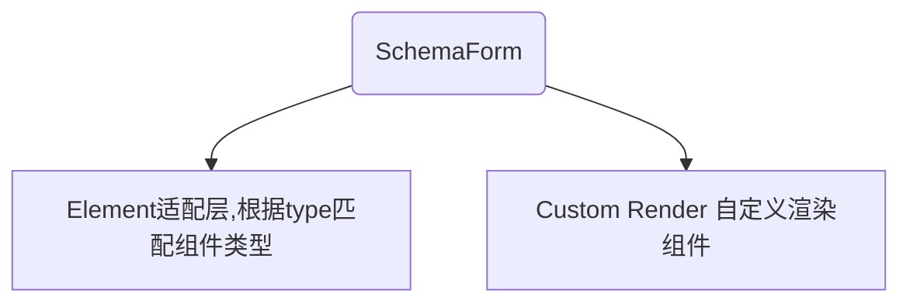

# schema-form

## 给开发者用的表单工具（基于 Ant Design React）

**基于 Ant Design React 而开发的适配组件，尽量使用数据来替代元素标签。**

[开发者文档+在线 Demo](https://ayiaq1.github.io/schema-form/)

###### SchemaForm 组件

```
<SchemaForm
  type="custom"
  initialValues={initValues}
  disabled={disabled}
  form={form}
  onFinish={onFinish}
  onValuesChange={onValuesChange}
  options={[
  {
    label:"Form.Item的label",
    name:"Form.Item的name",
    type:"input",
  ]}
/>
```

###### 也可以单独使用的元素组件

```
<Element type="text" value="test text" />
```

## 整体结构图



## Element 作为元素组件的适配层而存在，也可以单独引入使用

````mermaid
graph TB
    Element(Element适配层,支持的类型) --> type[type]
    type --> |text| Text[Text]
    type --> |input| InputWrap[InputWrap:增加了Input的过滤空格功能]
    type --> |list-wrap| ListWrap[ListWrap]
    type --> |other| Ant的类型推导,详见:```API:Element.type```
````

## API:SchemaForm 包裹 Form 的组件

| 参数          | 描述                                                 | 类型                | 默认值 |
| ------------- | ---------------------------------------------------- | ------------------- | :----- |
| type          | 设置布局样式。row：使用 Row 包裹。custom: 直接渲染。 | row                 | custom |
| disabled      | 是否禁用，如果 item 有，以 item 的为结果             | boolean             | -      |
| options       | 渲染列表                                             | IFormItem[]         | -      |
| form          | 外部传入的：`Form.useForm()`                         | FormInstance        | -      |
| initialValues | form.initialValues 透传                              | Record<string, any> | -      |

### API: SchemaForm.type=row 类型为 row 时的参数

| 参数   | 描述          | 类型   | 默认值 |
| ------ | ------------- | ------ | :----- |
| gutter | Row 的 gutter | number | 16     |
| span   | Row 的 span   | number | 6      |

### API: SchemaForm.options 渲染列表，包裹 Form.Item 的数组

| 参数       | 描述                                                      | 类型                                             | 默认值 |
| ---------- | --------------------------------------------------------- | ------------------------------------------------ | :----- |
| disabled   | 当前这一条 item 内容是否禁用                              | boolean                                          | -      |
| render     | 只有 custom 类型 才有的渲染 children 方法                 | (props: ISchemaChildrenProps) => React.ReactNode | -      |
| fieldProps | 透传组件参数。                                            | 以 type 自动推动组件类型                         | -      |
| col        | `type:row`类型时，col 的占位,如果 item 有。以 item 为结果 | number                                           | -      |
| width      | 铺满 item 宽度。默认：宽度 100%。auto: 使用默认组件宽度   | string                                           | -      |
| type       | 联合类型，详见：`API:SchemaForm.options.type`             | IUnionType                                       | -      |
| other      | Ant 的 FormItemProps 参数                                 | FormItemProps                                    | -      |

### API:Element.type Element 组件的 type 枚举

| 支持的 type        | 描述（Ant 的类型推导几乎都是组件的小驼峰拼写：TimePicker.RangePicker -> timeRangePicker） |
| ------------------ | ----------------------------------------------------------------------------------------- |
| text               | 只读文本。设置宽度之后支持超长隐藏                                                        |
| input              | 包裹 Ant 的 Input，增加了默认参数。详见: `API:Input`                                      |
| list-wrap          | 列表组件，通过 mode 可以修改为只读、编辑状态                                              |
| input-group        | Input.Group                                                                               |
| textarea           | Input.TextArea                                                                            |
| search             | Input.Search                                                                              |
| password           | Input.Password                                                                            |
| input-number       | InputNumber                                                                               |
| select             | Select                                                                                    |
| datepicker         | DatePicker（单个日期）                                                                    |
| rangepicker        | DatePicker.RangePicker（日期区间）                                                        |
| timePicker         | TimePicker（单个时间）                                                                    |
| timeRangePicker    | TimePicker.RangePicker（时间区间）                                                        |
| checkbox           | Checkbox                                                                                  |
| checkbox-group     | Checkbox.Group                                                                            |
| radio-group        | Radio.Group                                                                               |
| rate               | Rate                                                                                      |
| slider             | Slider                                                                                    |
| switch             | Switch                                                                                    |
| upload             | Upload                                                                                    |
| avatar             | Avatar                                                                                    |
| image              | Image                                                                                     |
| tag                | Tag                                                                                       |
| progress           | Progress                                                                                  |
| tree-select        | TreeSelect                                                                                |
| cascader           | Cascader                                                                                  |
| 错误类型会抛出错误 | 没有找到对应的 type 类型                                                                  |

### API:SchemaForm.options.type SchemaForm 组件的 Item.type 枚举

| 支持的 type  | 描述                         | 类型                                               | 默认值 |
| ------------ | ---------------------------- | -------------------------------------------------- | :----- |
| Element.type | 支持所有的 Element.type 类型 | EnumElementType                                    | -      |
| group        | 将 Item 作为一个组包裹       | string                                             | -      |
| custom       | 自定义渲染组件               | `(props: ISchemaChildrenProps) => React.ReactNode` | -      |

### 逐步完善的单页测试


