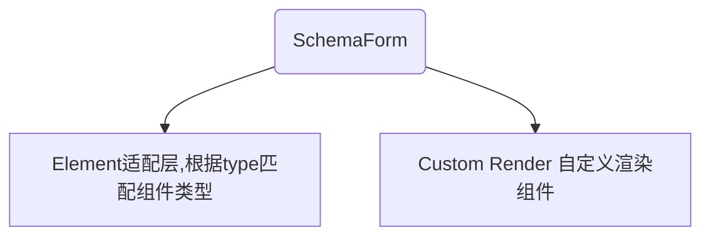

# schema-form

## 给开发者用的表单工具（基于 Ant Design React）

**基于 Ant Design React 而开发的适配组件，尽量使用数据来替代元素标签。**

### 安装

```

npm install -D @dawdler/schema-form

```

### 文档

[开发者文档+在线 Demo](https://ayiaq1.github.io/schema-form/)

**基于 Ant Design React 而开发的适配组件，尽量使用数据来替代元素标签。**

# 更新日志

0.0.9: 基础版本 1.0.0: 将各组件独立抽离，type 类型统一为 antd 的小驼峰命名:TimePicker.RangePicker -> timeRangePicker）

# 使用

##### SchemaForm：type:row | custom 2 种布局方式

```
import SchemaForm from '@dawdler/schema-form';

/** row */
<SchemaForm
  type="row"
  gutter={16}
  span={12}
  options={[
    {
      label: '输入框',
      type: 'input',
    },
  ]}
/>

/** custom */
<SchemaForm
  type="custom"
  options={[
    {
      label: '输入框',
      type: 'input',
    },
  ]}
/>
```

## 整体结构图



## 默认布局：row

<code src="./packages/element/example/SchemaDemoRow.tsx" />

## 自定义布局: custom

<code src="./packages/element/example/SchemaDemoCustom.tsx" />

## API

### SchemaForm 包裹 Form 的组件

| 参数 | 描述 | 类型 | 默认值 |
| --- | --- | --- | :-- |
| type | 设置布局样式。row：使用 Row 包裹。custom: 直接渲染。 | boolean | - |
| disabled | 是否禁用，如果 item 有，以 item 的为结果 | boolean | - |
| readOnly | 是否只读，如果 item 有，以 item 的为结果 | boolean | - |
| options | 渲染列表 | IFormItem[] | - |
| form | 外部传入的：`Form.useForm()` | FormInstance | - |
| initialValues | form.initialValues 透传 | Record<string, any> | - |

### SchemaForm.type=row 类型为 row 时的参数

| 参数   | 描述          | 类型   | 默认值 |
| ------ | ------------- | ------ | :----- |
| gutter | Row 的 gutter | number | 16     |
| span   | Row 的 span   | number | 6      |

### options 渲染列表，包裹 Form.Item 的数组

| 参数 | 描述 | 类型 | 默认值 |
| --- | --- | --- | :-- |
| disabled | 当前这一条 item 内容是否禁用 | boolean | - |
| readOnly | 当前这一条 item 内容是否只读 | boolean | - |
| render | 只有 custom 类型 才有的渲染 children 方法 | (props: ISchemaChildrenProps) => React.ReactNode | - |
| fieldProps | 透传组件参数。 | 以 type 自动推动组件类型 | - |
| col | `type:row`类型时，col 的占位,如果 item 有。以 item 为结果 | number | - |
| width | 铺满 item 宽度。默认：宽度 100%。auto: 使用默认组件宽度 | string | 100% |
| type | 联合类型，详见：`API:options.type` | IUnionType | - |
| other | Ant 的 FormItemProps 参数 | FormItemProps | - |

### options.type SchemaForm 组件的 Item.type 枚举

| 支持的 type | 描述 | 类型 | 默认值 |
| --- | --- | --- | :-- |
| Element.type | 支持所有的 Element.type 类型 | EnumElementType | - |
| group | 将 Item 作为一个组包裹 | string | - |
| custom | 自定义渲染组件 | `(props: ISchemaChildrenProps) => React.ReactNode` | - |

## 逐步完善的单元测试


